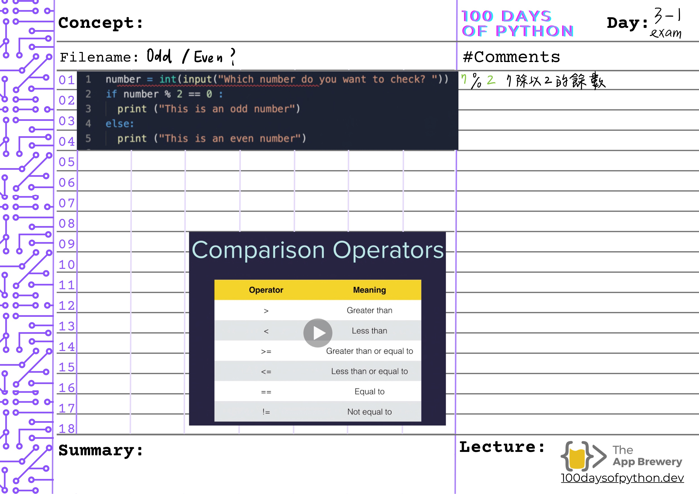
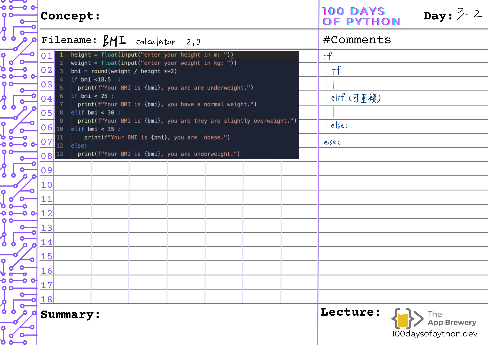

# 🗓️ Day 3 - Treasure Island Game

## ✅ Goal
- Build a simple text-based adventure game
- Practice using `if` / `elif` / `else` statements
- Understand how indentation and logic affect program flow

## 💡 Key Notes
- `%` gives the remainder of division (e.g. `7 % 2 = 1` → odd)
- `==`, `!=`, `>`, `<`, `>=`, `<=` are comparison operators
- `if` is for a single condition; `elif` allows multiple branches; `else` is the fallback
- Python uses indentation (usually 4 spaces) to define code blocks
- You can nest `if` statements to handle more complex conditions
- `.lower()` helps handle user input case-insensitively
- Use `input()` to collect choices, and store them in variables

## 🖼️ Handwritten Notes

