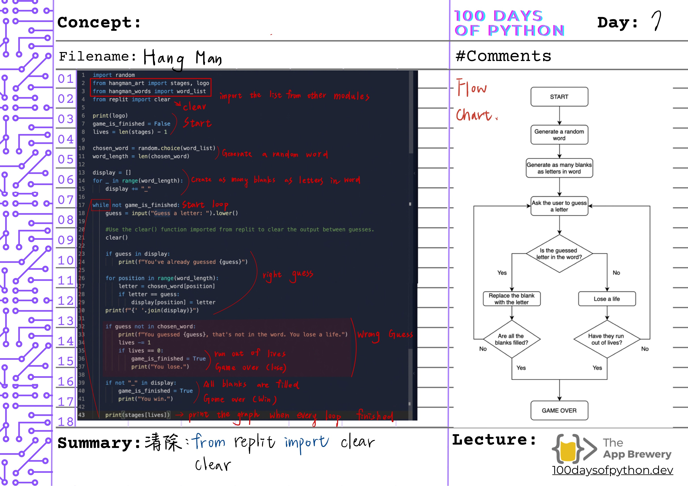

# 🗓️ Day 7 - Hangman Game (Full Version)

## ✅ Goal
- Create a fully playable word guessing game
- Practice control flow with `while` loops and conditionals
- Manage game states, user input, and visual output

## 💡 Key Notes
- Draw a flow chart first!

## 🧭 Flowchart

